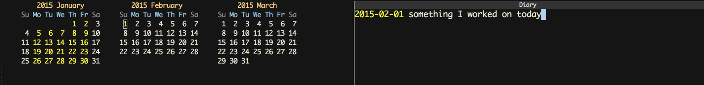

# Using Emacs for daily reminders to write in my ~/diary

I worked remotely for a year or so and I took it upon myself to figure
out ways to improve my communication with HQ. One of the useful things
I found was [sending a weekly email summary][weekly] to my manager, as
a touch point for them to be able to see my week to week
progress[^1]. I soon realized that I had no memory at all for
recalling what I did the previous day, much less for a whole week, so
I began looking into what options Emacs offered for daily diary
note-keeping kind of things[^2].

Google told me that I should to use the `calendar` and `diary`
functions to make my notes. `M-x calendar` brings up a three month
calendar view, and `M-x diary` opens the `~/diary` file on your
computer in a special `diary-mode`. Each line in the diary file starts
with the date in whatever format you want (`'iso`), and then you can
put notes for that day. When cursoring about the calendar, pressing
<kbd>i d</kbd> opens up the diary with a new entry for that date ready
to accept some text.

    ;; dg-diary.el
    (require 'calendar)
    (calendar-set-date-style 'iso)

    ;; ~/diary
    2015-01-17 some notes for the day!

The diary and the calendar have a pretty tight integration that I'm
still trying to learn! Of course, the biggest issue was remembering to
actually remember to write in my diary in the first place. For a
while, I had a Google Now reminder, but a daily reminder ended up
clogging the entire Inbox interface, as they really call reminders to
the forefront there. So, I tried to figure out how to set a daily
reminder in Emacs and came up with the following:

    (defun remind-me-daily (fn time)
      (when (and (boundp 'daily-reminder)
                 (timerp daily-reminder))
        (cancel-timer daily-reminder))
      (let ((daily (* 60 60 24)))
        (setq daily-reminder
              (run-at-time time daily 'funcall fn))))

    (remind-me-daily 'toggle-diary-windows "4:30pm")

Basically, [`run-at-time`][rat] is doing all the work here. There's a
little work to make sure I'm not setting tons of reminders by
automatically clearing the existing `daily reminder`. Otherwise, we
just handle the number of seconds in a day and set our function to be
called daily.

`toggle-diary-windows` is a function that stores my current window
configuration before bringing up the calendar and the diary, putting
my cursor at the correct spot in the diary file to make notes for the
current day.

    (defun toggle-diary-windows ()
      (interactive)
      (toggle-app-and-home
       "Calendar"
       (lambda ()
         (window-configuration-to-register 6245)
         (calendar)
         (delete-other-windows)
         (text-scale-adjust 3)
         (execute-kbd-macro [?m ?. ?i ?d])
         (text-scale-adjust 0)
         (text-scale-adjust 2)
         (recenter-top-bottom))))

`toggle-app-and-home` is a custom function that checks whether any of
my open buffers match its first argument and decides if it should show
me the app (Calendar, in this case) or my previous window
configuration ("home"). A little involved, but probably easier to
understand in person. Basically, I've got a couple different apps that
I use in Emacs that are completely separate from authoring code: diary
things, mu4e for my mail, jabber for chat, etc. At any point, it's
useful to be able to toggle my whole window configuration to and from
setups that allow me to do those tasks.

After penning quick summary of the day's work, I use my diary
keybinding to toggle back to my previous window configuration and
continue on my way. At the end of the week, I've got a few sentence
fragments for each day and an easy way to write the Accomplishments,
Blockers, and Next Week sections of my weekly summary.

If you liked this post, you may also be interested in how
[Sacha Chua is doing her process journaling!][sc]! My complete file for
customizing my diary interactions is [on Github][dg-diary].

[weekly]: https://dria.wordpress.com/2010/02/25/on-11s/
[rat]: https://www.gnu.org/software/emacs/manual/html_node/elisp/Timers.html
[sc]: http://sachachua.com/blog/2014/11/using-org-mode-keep-process-journal/
[dg-diary]: https://github.com/gempesaw/dotemacs/blob/emacs/dg-elisp/dg-diary.el

[^1]: This was in addition to daily standup check-ins and weekly 1 on 1s and so on - I wanted to do _more_ communication on top of all that.
[^2]: This is unfortunately not an org mode post, as that's one of the Emacs things that I have actually managed not to do so far.
